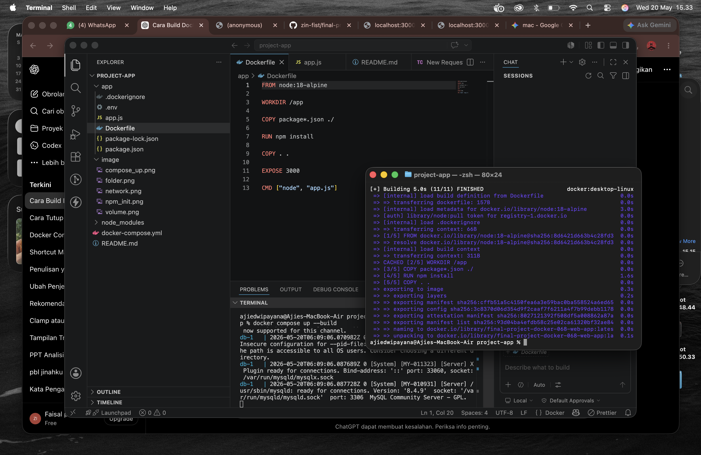

# Laporan Hasil Praktikum: Final Project Aplikasi Berbasis Container

## Identitas Mahasiswa

- **Nama:** Faisal Priambodo Putra
- **NIM:** 2415354068
- **Kelas/Rombel:** 4D TRPL
- **Tanggal Praktikum:** 20 Mei 2026

---

## Teknologi & Tools yang Digunakan

- **Sistem Operasi:** Mac OS Ventura
- **Containerization:** Docker & Docker Hub
- **Bahasa Pemrograman / Framework:** Node.js
- **Tools Lain:** VS Code, Git, Postman

---

## Langkah-Langkah Praktikum & Dokumentasi

### Langkah 1: [Tulis Nama Langkah 1, Contoh: Membuat Dockerfile]

Jelaskan secara singkat apa yang dilakukan pada langkah pertama ini. Jika ada kode atau perintah terminal, tulis seperti contoh di bawah:

```bash
# Contoh perintah terminal yang dijalankan
docker build -t app-good .
```

**Dokumentasi/Screenshot:**


---

### Langkah 2: [Tulis Nama Langkah 2, Contoh: Tag dan Push ke Docker Hub]

Jelaskan proses penamaan ulang _image_ dan proses unggah ke Docker Hub milik Anda.

```bash
docker tag app-good madedianpp/app-good:v1.0
docker push madedianpp/app-good:v1.0
```

**Dokumentasi/Screenshot:**


---

### Langkah 3: [Tulis Nama Langkah 3, Contoh: Pengujian Pull dan Run Container]

Jelaskan bagaimana cara melakukan verifikasi atau pengujian bahwa praktikum Anda berhasil berjalan.

```bash
docker run -d -p 8080:8080 madedianpp/app-good:v1.0
```

**Dokumentasi/Screenshot:**


---

## Kesimpulan

Build Docker adalah proses membuat Docker Image dari aplikasi menggunakan Dockerfile sebagai “resep”. Proses ini dilakukan dengan perintah docker build, yang akan mengemas seluruh aplikasi beserta dependensinya ke dalam sebuah image. Setelah image berhasil dibuat, aplikasi dapat dijalankan sebagai container menggunakan docker run, sehingga aplikasi bisa berjalan di lingkungan yang konsisten di mana pun tanpa perlu konfigurasi ulang di setiap perangkat.
